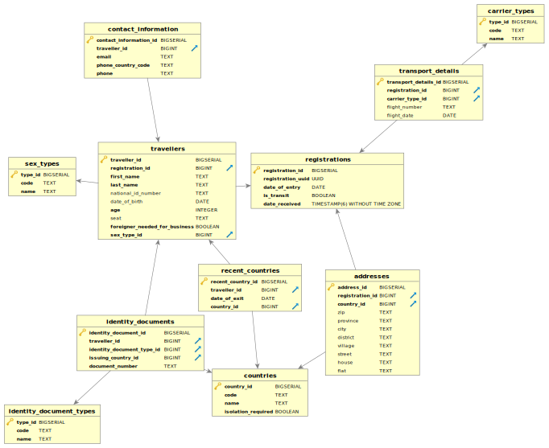

# Getting Started

This is an open-source implementation of Immigration Electronic Control System (Ieceļotāju uzskaites kontroles elektroniskā sistēma)
### Reference Documentation
For further reference, please consider the following sections:

* [Ieceļotāju uzskaites kontroles elektroniskās sistēmas izveide](https://www.sam.gov.lv/lv/iepirkums/iecelotaju-uzskaites-kontroles-elektroniskas-sistemas-izveide)

### Database Structure


### API

#### Create Registration

##### URL
/registrations

##### Method
POST

##### Params

```yaml
{
    "transportDetails": {
        "carrierType": "PLANE",
        "flightNumber": "BT101",
        "flightDate": "2020-08-06"
    },
    "dateOfEntry": "2020-08-07",
    "isTransit": false,
    "travellers": [{
        "firstName": "John",
        "lastName": "Brown",
        "identityDocument": {
            "documentType": "PASSPORT",
            "issuingCountryCode": "LV",
            "documentNumber": "PA1922112"
        },
        "nationalIdNumber": "721229-11302",
        "dateOfBirth": "1972-12-29",
        "sex": "MALE",
        "age": 48,
        "seat": "9A",
        "foreignerNeededForBusiness": false,
        "contactInformation": {
            "email": "john.b@gmail.com",
            "phoneCountryCode": "+371",
            "phoneNumber": "94186444"
        },
        "recentCountries": [{
            "countryCode": "LV",
            "dateOfExit": "2020-08-07"
        }]
    }],
    "addresses": [{
        "countryCode": "LV",
        "zip": "LV-1012",
        "province": null,
        "city": "Rīga",
        "district": null,
        "village": null,
        "street": "Brīvības",
        "house": "121A",
        "flat": "5"
    }]
}
```


##### Response

```yaml
{
    "transportDetails": {
        "carrierType": "PLANE",
        "flightNumber": "BT101",
        "flightDate": "2020-08-06"
    },
    "dateOfEntry": "2020-08-07",
    "isTransit": false,
    "travellers": [{
        "firstName": "John",
        "lastName": "Brown",
        "identityDocument": {
            "documentType": "PASSPORT",
            "issuingCountryCode": "LV",
            "documentNumber": "PA1922112"
        },
        "nationalIdNumber": "721229-11302",
        "dateOfBirth": "1972-12-29",
        "sex": "MALE",
        "age": 48,
        "seat": "9A",
        "foreignerNeededForBusiness": false,
        "contactInformation": {
            "email": "john.b@gmail.com",
            "phoneCountryCode": "+371",
            "phoneNumber": "94186444"
        },
        "recentCountries": [{
            "countryCode": "LV",
            "dateOfExit": "2020-08-07"
        }]
    }],
    "addresses": [{
        "countryCode": "LV",
        "zip": "LV-1012",
        "province": null,
        "city": "Rīga",
        "district": null,
        "village": null,
        "street": "Brīvības",
        "house": "121A",
        "flat": "5"
    }],
    "dateReceived": "2020-08-07T16:45:42",
    "registrationId": "a992614d-b80b-4f9e-9074-ea23eaf205f4"
}
```